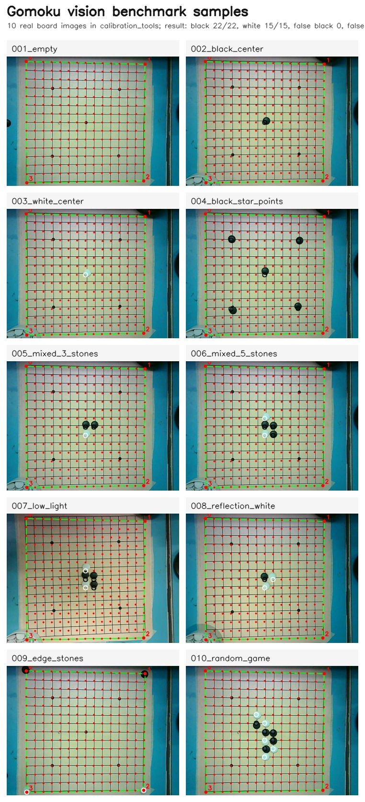
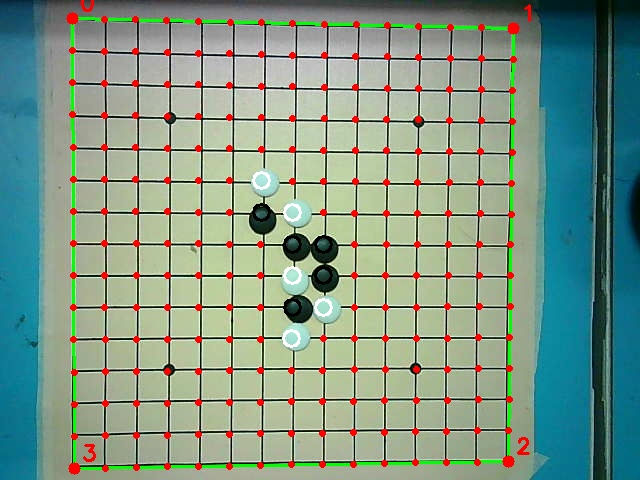

# Gomoku Vision Benchmark Evidence

整理日期：2026-05-30

本页用于向老师/学长说明：五子棋机器人视觉模块已经整理出一批可复现的实拍棋盘照片 benchmark，包括图片路径、人工标注、检测脚本、benchmark 指标和可视化输出。

## 一句话结论

当前 benchmark 数据集直接放在 `calibration_tools/` 下，共 10 张实拍棋盘照片，覆盖空棋盘、中心黑棋、中心白棋、星位黑棋、混合局面、低光、白棋反光、边缘棋子和随机局面。

使用同一套检测参数运行后：

```text
black recall: 22/22 = 100.00%
white recall: 15/15 = 100.00%
false black: 0
false white: 0
```

同时，`tools/live_vision_monitor.py` 可以把保存的棋盘照片转换成 15x15 棋盘矩阵，并生成带检测标记的可视化结果图。也就是说，这批照片已经可以作为当前阶段的“实拍图片 benchmark”展示。

## 关键文件路径

仓库：

```text
D:/Projects/gomoku_project
```

benchmark 图片目录：

```text
D:/Projects/gomoku_project/calibration_tools
```

人工标注文件：

```text
D:/Projects/gomoku_project/calibration_tools/label.txt
```

benchmark 脚本：

```text
D:/Projects/gomoku_project/tools/benchmark_vision.py
```

live monitor 脚本：

```text
D:/Projects/gomoku_project/tools/live_vision_monitor.py
```

单张检测结果输出图：

```text
D:/Projects/gomoku_project/outputs/board_010_live_monitor.jpg
```

10 张样本总览图：

```text
D:/Projects/gomoku_project/docs/assets/benchmark_evidence_2026-05-30/benchmark_samples_contact_sheet_2026-05-30.jpg
```

所有带检测标记的图片：

```text
D:/Projects/gomoku_project/docs/assets/benchmark_evidence_2026-05-30/annotated
```

## 图片清单

```text
calibration_tools/board_001_empty.jpg
calibration_tools/board_002_black_center.jpg
calibration_tools/board_003_white_center.jpg
calibration_tools/board_004_black_star_points.jpg
calibration_tools/board_005_mixed_3_stones.jpg
calibration_tools/board_006_mixed_5_stones.jpg
calibration_tools/board_007_low_light.jpg
calibration_tools/board_008_reflection_white.jpg
calibration_tools/board_009_edge_stones.jpg
calibration_tools/board_010_random_game.jpg
```

这些图片可以证明：当前测试不是只在单一棋子场景上跑通，而是覆盖了多种真实干扰情况，包括反光、低光、边缘棋子和混合局面。

## 样本总览图



## label.txt 标注方式

`label.txt` 每张图片占 3 行：

```text
图片文件名
black: 黑棋坐标列表
white: 白棋坐标列表
```

坐标格式：

```text
row,col
```

多枚棋子用分号分隔：

```text
black: 7,7; 7,8; 8,8
white: 6,7; 8,7
```

坐标是 0-based，也就是左上角为 `(0,0)`，右下角为 `(14,14)`。

空棋盘或某一类棋子为空时，保留字段但不填坐标：

```text
board_001_empty.jpg
black:
white:
```

## benchmark 运行命令

在仓库根目录运行：

```powershell
python .\tools\benchmark_vision.py --image-dir .\calibration_tools --labels .\calibration_tools\label.txt --corners "72,18;513,28;508,461;74,468"
```

角点含义：

```text
72,18   -> 左上角
513,28  -> 右上角
508,461 -> 右下角
74,468  -> 左下角
```

## benchmark 输出结果

```text
board_001_empty.jpg
  pred_black: []
  pred_white: []
board_002_black_center.jpg
  pred_black: [(7, 7)]
  pred_white: []
board_003_white_center.jpg
  pred_black: []
  pred_white: [(7, 7)]
board_004_black_star_points.jpg
  pred_black: [(3, 3), (3, 11), (7, 7), (11, 3), (11, 11)]
  pred_white: []
board_005_mixed_3_stones.jpg
  pred_black: [(7, 7), (7, 8)]
  pred_white: [(8, 7)]
board_006_mixed_5_stones.jpg
  pred_black: [(7, 7), (7, 8), (8, 8)]
  pred_white: [(6, 7), (8, 7)]
board_007_low_light.jpg
  pred_black: [(7, 7), (7, 8), (8, 8)]
  pred_white: [(6, 7), (8, 7)]
board_008_reflection_white.jpg
  pred_black: [(7, 7)]
  pred_white: [(7, 8), (8, 7)]
board_009_edge_stones.jpg
  pred_black: [(0, 0), (0, 14)]
  pred_white: [(14, 0), (14, 14)]
board_010_random_game.jpg
  pred_black: [(6, 6), (7, 7), (7, 8), (8, 8), (9, 7)]
  pred_white: [(5, 6), (6, 7), (8, 7), (9, 8), (10, 7)]

SUMMARY
black recall: 22/22 = 100.00%
white recall: 15/15 = 100.00%
false black: 0
false white: 0
```

## live monitor 输出图

运行命令：

```powershell
python .\tools\live_vision_monitor.py --image .\calibration_tools\board_010_random_game.jpg --corners "72,18;513,28;508,461;74,468" --output .\outputs\board_010_live_monitor.jpg --no-window
```

输出矩阵：

```text
0 0 0 0 0 0 0 0 0 0 0 0 0 0 0
0 0 0 0 0 0 0 0 0 0 0 0 0 0 0
0 0 0 0 0 0 0 0 0 0 0 0 0 0 0
0 0 0 0 0 0 0 0 0 0 0 0 0 0 0
0 0 0 0 0 0 0 0 0 0 0 0 0 0 0
0 0 0 0 0 0 2 0 0 0 0 0 0 0 0
0 0 0 0 0 0 1 2 0 0 0 0 0 0 0
0 0 0 0 0 0 0 1 1 0 0 0 0 0 0
0 0 0 0 0 0 0 2 1 0 0 0 0 0 0
0 0 0 0 0 0 0 1 2 0 0 0 0 0 0
0 0 0 0 0 0 0 2 0 0 0 0 0 0 0
0 0 0 0 0 0 0 0 0 0 0 0 0 0 0
0 0 0 0 0 0 0 0 0 0 0 0 0 0 0
0 0 0 0 0 0 0 0 0 0 0 0 0 0 0
0 0 0 0 0 0 0 0 0 0 0 0 0 0 0
Saved annotated image: .\outputs\board_010_live_monitor.jpg
```

结果图：



## 测试结果

```powershell
python -m pytest tests/test_vision_benchmark_dataset.py tests/test_live_vision_monitor.py
```

```text
4 passed in 0.87s
```

## 可以对老师这样描述

我把真实棋盘照片整理成了一个可复现 benchmark：10 张图都放在 `calibration_tools/` 下，每张图都有人工标注的黑白棋坐标。benchmark 脚本会把预测结果和标注逐项对比，输出黑棋/白棋召回率以及误检数。当前这批实拍图上黑棋召回率 22/22、白棋召回率 15/15，黑白误检均为 0；同时我做了 live monitor 工具，可以把棋盘照片或摄像头画面转换成 15x15 board matrix，并生成带检测标记的可视化结果图。

## 当前边界

这 10 张图已经可以作为当前阶段的实拍 benchmark 展示。更准确的说法是：

```text
已完成：一批实拍静态图片 benchmark + 人工标注 + 检测指标 + 可视化输出。
下一步：继续采集新的 live/camera session，单独建日期目录，验证换光照和换摆放后的泛化能力。
```

不要说成“所有真实摄像头场景已经完全验证”，因为当前还只有这一批固定相机视角和固定棋盘位置下的图片。更稳妥的表达是：

```text
I built a reproducible benchmark from real board images and verified the current vision pipeline on black, white, mixed, low-light, reflection, edge-stone and random-board cases.
```

## 下一步命令

后续如果要再采一批新的摄像头 session，可以新建日期目录：

```powershell
python .\tools\live_vision_monitor.py --camera-id 0 --corners "实际新角点" --capture-dir .\calibration_tools\live_benchmark_20260530
```

标注后运行：

```powershell
python .\tools\benchmark_vision.py --image-dir .\calibration_tools\live_benchmark_20260530 --labels .\calibration_tools\live_benchmark_20260530\label.txt --corners "实际新角点"
```
