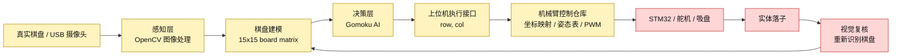
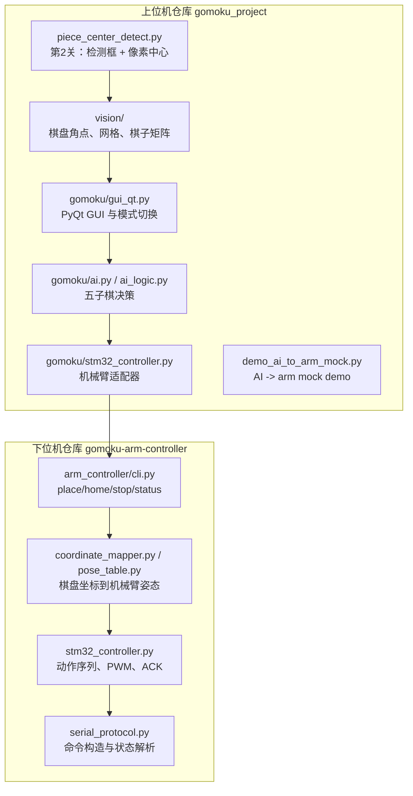

# 硬核工程作品集任务页：感知-决策-机械臂执行链路

更新时间：2026-06-03  
优先级：P0  
截止日期：2026-06-06  
证据来源：

```text
上位机 GitHub 主仓 / 本地路径：D:\Projects\gomoku_project
下位机 GitHub 仓库：https://github.com/KITTIYOJIANG/gomoku-arm-controller
下位机本地路径：D:\Projects\gomoku_arm_controller
```

## 验收标准

本页用于作品集展示前的工程梳理，目标是清晰说明：

- 感知 -> 决策 -> 机械臂执行的完整链路；
- 每个模块的责任边界；
- 当前完成度和风险；
- 已经能展示的证据；
- 下一步需要补齐的动作。

## 1. 系统主链路



当前判断：

- 静态视觉 benchmark 已经稳定，旧数据黑白棋识别达到 100% recall 且 0 误报。
- 实时 USB 摄像头第 2 关正在现场调参，已经具备检测框、中心点、坐标打印、滑条调参和跨帧稳定能力。
- 上位机到机械臂已经有 mock 级接口，真实机械臂闭环仍需硬件标定和单步验证。

## 2. 模块边界



边界原则：

| 层级 | 负责什么 | 不负责什么 |
|---|---|---|
| 感知层 | 摄像头读取、棋子检测、像素中心、棋盘矩阵 | AI 决策、机械臂 PWM |
| 棋盘建模层 | 将视觉结果转成 15x15 局面 | 真实运动控制 |
| 决策层 | 根据局面输出下一步 `(row, col)` | 机械臂路径规划 |
| 上位机适配层 | 把 AI 结果交给机械臂控制仓库 | 直接控制每个舵机 |
| 机械臂控制层 | 坐标合法性、姿态表、动作序列、PWM/串口、ACK/STOP | 视觉识别和 AI |
| STM32/执行层 | 驱动舵机、吸盘、急停、状态返回 | 决策落子位置 |

## 3. 模块清单与完成度

| 模块 | 当前完成度 | 状态 | 可展示证据 | 下一步 |
|---|---:|---|---|---|
| 第 2 关棋子中心检测 | 75% | 已有实时窗口、检测框、中心点、坐标打印、滑条、稳定器 | `piece_center_detect.py`，现场运行 `--tune` | 固定现场参数，录制演示证据 |
| 静态视觉 benchmark | 100% | 10 张基准图黑白 100% recall，0 误报 | `tools/benchmark_vision.py`，`docs/assets/benchmark_evidence_2026-05-30/` | 保持为回归基线 |
| 棋盘网格/矩阵识别 | 85% | 已有角点、网格、`detect_stones()` 输出矩阵 | `vision/grid_mapper.py`，`vision/stone_detector.py` | 与第 2 关像素中心结果合流 |
| PyQt 上位机 GUI | 75% | 已有三种模式、棋盘显示、摄像头线程、AI 请求 | `main.py`，`gomoku/gui_qt.py` | 修复部分中文显示乱码，增强比赛展示 |
| 五子棋 AI | 80% | 可在 empty/block_four/win_now 场景输出决策 | `demo_ai_to_arm_mock.py`，`tests/test_ai_to_arm_demo.py` | 增加解释型输出和实战稳定性 |
| 上位机到机械臂 mock | 70% | 已证明接口边界是 `(row, col)` | `demo_ai_to_arm_mock.py`，`gomoku/stm32_controller.py` | 解析机械臂 CLI 最终状态行 |
| 机械臂 CLI | 65% | 支持 `place/home/stop/status`、mock、pose table、ACK 参数 | `arm_controller/cli.py` | 在真实串口环境验证 |
| 姿态表/标定 | 55% | 有 `PoseTable` 和四角插值，示例 pose table | `pose_table.py`，`calibration/poses.example.json` | 采集真实 `poses.real.json` |
| 机械臂动作序列 | 55% | 已有 source hover/pickup、pump、board hover/place 逻辑 | `stm32_controller.py` | 单步真实硬件验证 |
| STM32/舵机硬件闭环 | 25% | 协议和 ACK 逻辑已设计，真实硬件未完全验证 | `docs/stm32_protocol.md` | 先 home/stop/status，再单格落子 |

## 4. 可展示证据

| 证据类型 | 路径/命令 | 说明 |
|---|---|---|
| 第 2 关实时检测 | `python .\piece_center_detect.py --camera-id 2 --tune --no-labels --print-every 10` | USB 摄像头实时框出棋子并输出中心 |
| 稳定检测命令 | `python .\piece_center_detect.py --camera-id 2 --stability 7 --print-every 10` | 用跨帧稳定减少白子闪烁 |
| 静态视觉 benchmark | `python .\tools\benchmark_vision.py --image-dir .\calibration_tools --labels .\calibration_tools\label.txt --corners "72,18;513,28;508,461;74,468"` | 当前旧 benchmark 黑白 100%，0 误报 |
| 视觉证据图 | `docs/assets/benchmark_evidence_2026-05-30/` | 棋盘检测标注图和 contact sheet |
| 单元测试 | `python -m pytest tests -q` | 上位机当前测试通过 |
| AI -> arm mock | `python .\demo_ai_to_arm_mock.py --case win_now` | AI 选点后调用机械臂适配器 |
| 机械臂 mock place | `python -m arm_controller.cli place --row 7 --col 7 --mock` | 下位机 mock 执行落子命令 |
| 机械臂状态/急停 | `python -m arm_controller.cli status --port COM5`，`python -m arm_controller.cli stop --port COM5` | 真实硬件前置检查命令 |
| 协议文档 | `D:\Projects\gomoku_arm_controller\docs\stm32_protocol.md` | `OK row col` / `ERR ...` / PWM ACK 约定 |
| 系统进度页 | `docs/project_progress_dashboard.md` | 已有模块进度仪表盘 |

## 4.1 本次验证记录

验证时间：2026-06-03

| 仓库 | 命令 | 结果 |
|---|---|---|
| `D:\Projects\gomoku_project` | `python -m pytest tests -q` | `13 passed` |
| `D:\Projects\gomoku_project` | `python .\tools\benchmark_vision.py --image-dir .\calibration_tools --labels .\calibration_tools\label.txt --corners "72,18;513,28;508,461;74,468"` | black `22/22 = 100.00%`，white `15/15 = 100.00%`，false black `0`，false white `0` |
| `D:\Projects\gomoku_arm_controller` | `python -m pytest tests -q` | `24 passed` |

## 5. 当前仓库状态观察

上位机仓库 `D:\Projects\gomoku_project`：

- 当前主线代码已多次提交并推送到 GitHub。
- 未跟踪项仍存在：`agent_memory/`、`agent_memory.zip`、`PWM机械臂五子棋项目学习.pdf`。
- 这些未跟踪项目前不属于代码主线，不应随意纳入提交。

下位机仓库 `gomoku-arm-controller`：

- 当前存在多处未提交改动和新增文件。
- 已观察到新增或修改内容包括 `pose_table.py`、`calibration/`、CLI、协议、测试等。
- GitHub 远程仓库为 `https://github.com/KITTIYOJIANG/gomoku-arm-controller`。
- 由于这是独立下位机仓库的进行中改动，本页只作为状态引用，不直接修改该项目。

## 6. 当前卡点

| 卡点 | 影响 | 处理策略 |
|---|---|---|
| 第 2 关实时检测参数未固定 | 比赛展示不稳定 | 用 `--tune` 调参数，按 `p` 打印稳定命令并记录 |
| 白棋在 USB 画面下会闪烁 | 检测框不稳定 | 使用 `Stability=7/8`，同时调整 `WhiteGain` 和 `WhiteMin` |
| 棋盒和棋盘线可能误检 | 画面有多余框 | 开启 ROI，只保留棋盘区域；提高 `Strictness` |
| 第 3 关像素到行列还未作为独立演示完成 | 无法证明从像素检测到棋盘坐标 | 复用四角标定，把中心点映射成 `(row, col)` |
| 真实机械臂未闭环 | 无法完整展示实体落子 | 先 mock，再单步真实硬件，再完整闭环 |

## 7. 下一步动作

P0 到 2026-06-06 前建议按这个顺序推进：

1. 固定第 2 关现场参数。

```powershell
cd D:\Projects\gomoku_project
python .\piece_center_detect.py --camera-id 2 --tune --no-labels --print-every 10
```

2. 按 `p` 打印稳定命令，追加到 `docs/level2_piece_center_detection.md`。
3. 录制第 2 关证据：画面检测框 + 终端坐标输出。
4. 写第 3 关小脚本或扩展现有脚本：像素中心 `(x, y)` -> 棋盘 `(row, col)`。
5. 用 `demo_ai_to_arm_mock.py` 展示“识别/棋盘矩阵 -> AI -> row,col -> arm mock”。
6. 在 `gomoku_arm_controller` 中跑 mock place：

```powershell
cd D:\Projects\gomoku_arm_controller
python -m arm_controller.cli place --row 7 --col 7 --mock
```

7. 准备作品集展示页截图：
   - 系统链路图；
   - 模块完成度表；
   - benchmark 证据图；
   - 第 2 关现场截图；
   - mock 机械臂命令输出。

## 8. 作品集表述草稿

项目名称：

```text
基于视觉感知的桌面棋类具身智能机械臂系统
```

一句话描述：

```text
构建从真实棋盘视觉识别、五子棋 AI 决策到机械臂落子执行的感知-决策-行动链路，并将上位机视觉/AI 与下位机机械臂控制拆分为两个可独立测试的工程仓库。
```

当前可诚实展示的成果：

- OpenCV 实时检测黑白棋，输出检测框、中心点和像素坐标；
- 静态 benchmark 黑白棋识别 100% recall，0 误报；
- PyQt 上位机支持棋盘显示、AI 决策和模式切换；
- AI 到机械臂 mock 接口已打通；
- 机械臂控制仓库已具备 CLI、pose table、PWM command、ACK/STOP/status 设计。

需要避免夸大的内容：

- 不要声称真实机械臂完整闭环已经稳定完成；
- 不要声称第 2 关实时 USB 摄像头在所有光照下已经完全稳定；
- 不要把 mock 机械臂执行说成真实硬件执行。
