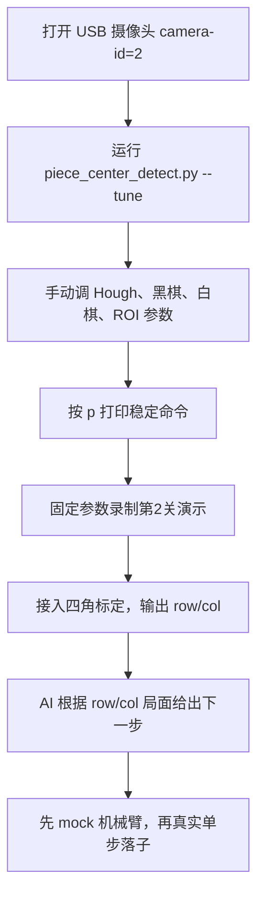

# 项目完善度仪表盘

更新时间：2026-06-02

说明：这里的百分比是工程推进度估计，不是比赛官方评分。它用于快速回顾当前项目做到哪一步、下一步该补什么。

## 一眼看全局

```mermaid
flowchart LR
    A["第1关：摄像头读取与棋盘画面"] --> B["第2关：黑白棋检测框与像素中心"]
    B --> C["第3关：像素中心转棋盘行列"]
    C --> D["第4关：AI 根据局面决策"]
    D --> E["第5关：上位机发送落子命令"]
    E --> F["第6关：机械臂安全落子"]
    F --> G["完整闭环：识别-决策-执行-复核"]

    classDef done fill:#d8f5d0,stroke:#2f7d32,color:#111;
    classDef active fill:#fff3bf,stroke:#b08900,color:#111;
    classDef next fill:#d8ecff,stroke:#1f6feb,color:#111;
    classDef risk fill:#ffd6d6,stroke:#c62828,color:#111;

    class A done;
    class B active;
    class C next;
    class D done;
    class E active;
    class F risk;
    class G risk;
```



## 模块完善度

| 模块 | 完善度 | 当前状态 | 下一步 |
|---|---:|---|---|
| 五子棋规则核心 | 90% | 已有落子、胜负判断、棋盘状态 | 补比赛演示用说明 |
| AI 决策 | 80% | 已能根据棋盘给出下一步 | 增加实战稳定性和解释输出 |
| PyQt 上位机 GUI | 75% | 已有棋盘显示、模式切换、AI 请求 | 修复部分中文显示乱码，增强比赛展示 |
| 静态视觉 benchmark | 100% | 旧数据黑白棋 100% recall，0 误报 | 作为回归基线保持不退化 |
| 实时 USB 摄像头检测 | 60% | 能打开 camera-id=2，正在调第2关检测框与中心 | 用滑条调出稳定参数 |
| 第2关：检测框与中心坐标 | 65% | 已有脚本、坐标打印、调参面板 | 固定一组现场参数并录制证据 |
| 第3关：像素转行列 | 45% | 旧主系统已有棋盘矩阵思路 | 把第2关中心坐标接入四角标定映射 |
| 上位机到机械臂 mock | 70% | 已有 mock 集成演示 | 与真实串口协议对齐 |
| 真实机械臂控制 | 25% | 下位机本地项目已拆分，暂未建立 GitHub 远程仓库，仍需硬件验证 | 单步 home、取子、落子、安全停止 |
| 文档与比赛材料 | 55% | README、benchmark、level2 记录已有 | 增加演示流程、问题记录、答辩图 |

## 当前关键结论

- 上位机静态视觉已经很强，但真实 USB 摄像头下还需要现场调参。
- 第 2 关现在的重点不是继续写复杂模型，而是把检测框、中心点和坐标输出调稳定。
- 第 3 关要从“像素中心坐标”进入“棋盘行列坐标”，需要复用四角标定。
- 硬件闭环还不能直接全自动，必须先做机械臂单步动作和安全停止。

## 比赛前最短可演示路线



## 每次开发后必查

```powershell
python -m pytest tests -q
python .\tools\benchmark_vision.py --image-dir .\calibration_tools --labels .\calibration_tools\label.txt --corners "72,18;513,28;508,461;74,468"
```

第 2 关现场调参：

```powershell
python .\piece_center_detect.py --camera-id 2 --tune --no-labels --print-every 10
```

## 当前风险

| 风险 | 影响 | 缓解方式 |
|---|---|---|
| 光照变化导致白棋不稳定 | 第2关展示失败 | 使用滑条调 `WhiteDiff`、`WhiteVMin`、`WhiteSMax` |
| 棋盘线和星位误检 | 满屏误框 | 提高 `HoughParam2`，提高 `MinRadius`，开启 ROI |
| 黑棋堆叠漏检 | 多子局面失败 | 调低 `BlackBlobDist`，调高 `BlackBlobVMax` |
| 右侧棋盒干扰 | 检测到棋盒里的棋子 | 使用 `--roi` 只保留棋盘区域 |
| 机械臂误动作 | 硬件风险 | 先 mock，再单步，再闭环；必须有 STOP/timeout |

## 下一步优先级

1. 用 `--tune` 调出一组适合当前 USB 摄像头和光照的第 2 关参数。
2. 把稳定参数记录到 `docs/level2_piece_center_detection.md`。
3. 录制第 2 关证据：窗口画面 + 终端坐标输出。
4. 开始第 3 关：把像素中心映射成棋盘 `(row, col)`。
5. 再回到 GUI，把第 2/3 关能力融合进完整上位机展示。
